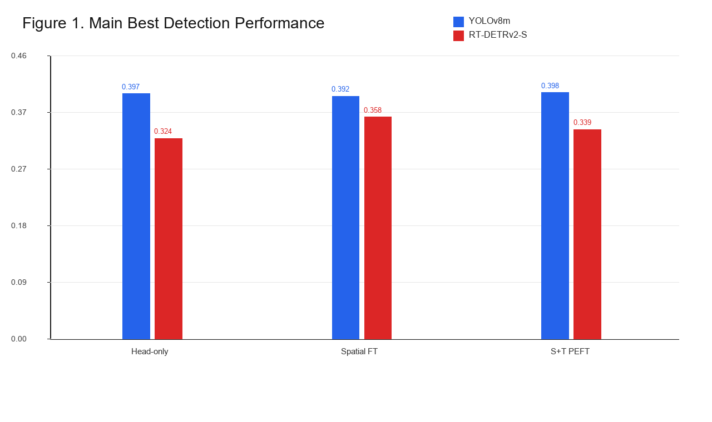
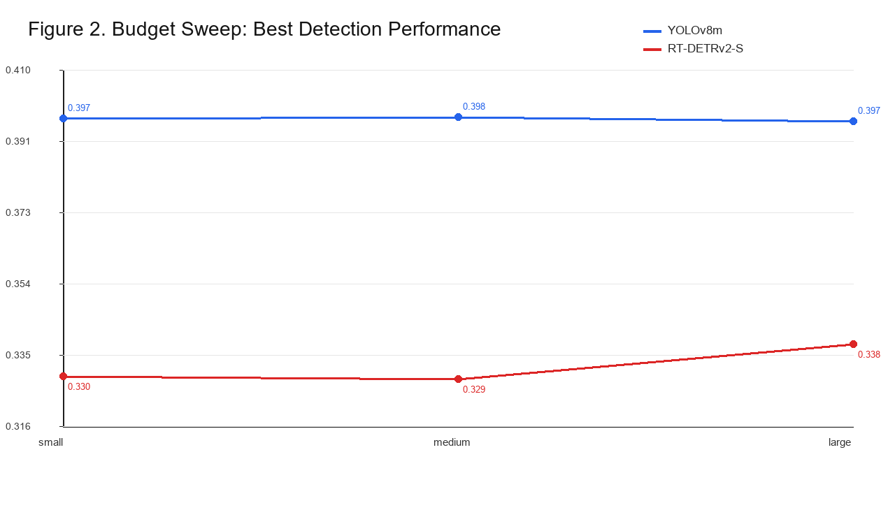
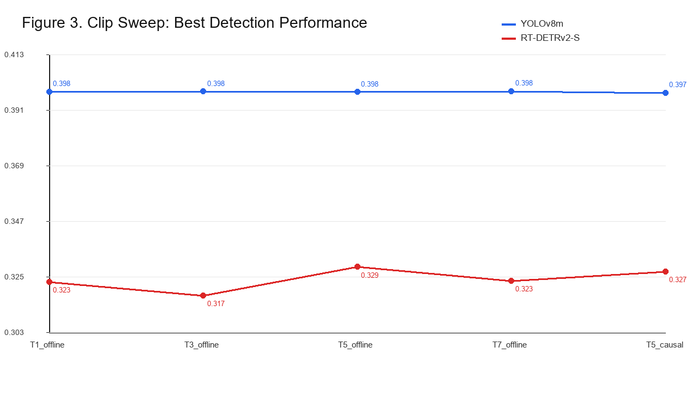
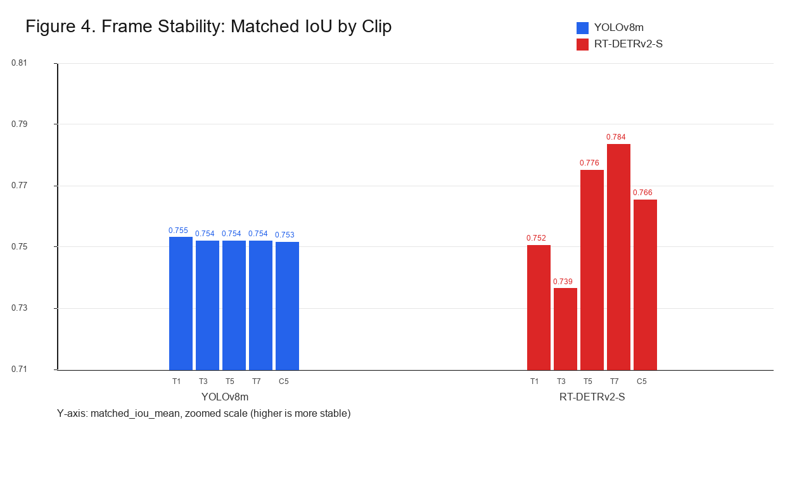

# Parameter-Efficient Video Object Detection: Comparing Temporal Adapters for RT-DETR and YOLO

RT-DETRv2-S/R18VD과 YOLOv8m를 YouTube-VIS detection 변환 데이터에서 비교한 비디오 객체 탐지 PEFT 실험 파이프라인입니다. 핵심 실험은 Transformer/query 계열 Detector와 CNN 계열 Detector가 비슷한 PEFT trainable parameter budget에서 Temporal adaptation에 어떻게 반응하는지 확인하는 것입니다.

## 실험 개요

- 비교 모델: `RT-DETRv2-S/R18VD`, `YOLOv8m`
- 데이터셋: YouTube-VIS 2021 bbox 변환
- 산출물 위치: `outputs/`
- 공식 Repo:
  - `third_party/ultralytics`
  - `third_party/RT-DETR`

본 Repository는 학습 실행보다 재현 가능한 실험 Scaffold, result aggregation, publication table/figure 생성을 목적으로 합니다.

## 활성 실험 매트릭스

Main comparison은 seed `0, 1, 2` 반복 평균으로 수행합니다.

| 조건 | 의미 | Clip | 비고 |
|---|---|---:|---|
| `head_only` | COCO pretrained에서 YouTube-VIS 40-class head warmup | T=1 | Prerequisite/reference |
| `spatial_only_full_ft` | Head warmup checkpoint에서 Temporal 없이 전체 Fine-tuning | T=1 | Strong spatial baseline |
| `spatial_temporal_peft` | Head freeze, Temporal adapter + RT-DETR LoRA 학습 | T=5 | Lightweight temporal PEFT |

추가 Ablation은 Seed 0만 수행합니다.

- Budget sweep: `spatial_temporal_peft`, T=5, small/medium/large
- Clip sweep: `spatial_temporal_peft`, medium, T1/T3/T5/T7/causal T5
- Frame stability: Clip sweep의 Best checkpoint prediction 기준

## PEFT Budget

Head parameter 수는 두 모델 구조상 크게 다르므로 PEFT budget에는 포함하지 않습니다. Head warmup 후 Head를 Freeze하고 Adapter/LoRA trainable parameter 수를 맞춥니다.

| Budget | YOLOv8m | YOLO PEFT params | RT-DETRv2-S/R18VD | RT-DETR PEFT params |
|---|---:|---:|---:|---:|
| small | P4 adapter dim 16 | 12,400 | LoRA rank 4 + P4 adapter dim 4 | 12,316 |
| medium | P4 adapter dim 32 | 24,800 | LoRA rank 8 + P4 adapter dim 8 | 24,632 |
| large | P4 adapter dim 64 | 49,600 | LoRA rank 16 + P4 adapter dim 16 | 49,264 |

## 주요 코드 구조

```text
src/
  shared/
    config.py              # config load/validation, experiment_id, path helpers
    main_experiment.py     # active config builder, run helper, stability spec
    result_aggregation.py  # seed repeat summary
    publication_outputs.py # Table 1-4, Figure 1-4 export
    frame_stability.py     # frame-level stability metrics
  yolo_temporal/
    experiment.py          # YOLO experiment entrypoint
    trainer.py             # Ultralytics trainer wrappers
    adapters.py            # P4 temporal adapter
    prediction_export.py   # frame-stability prediction export
  rtdetr_temporal/
    experiment.py          # RT-DETR experiment entrypoint
    official_train_with_policy.py
    official_predict_with_policy.py
    config_builder.py      # generated RT-DETR YAML writer
    prediction_export.py   # frame-stability prediction export
```

## 주요 실행 Cell

Config snapshot 생성과 실행:

```python
from src.shared.main_experiment import (
    build_seed_repeat_plan,
    build_budget_sweep_configs,
    build_clip_sweep_configs,
    run_main_experiment_configs,
    summarize_config_plan,
    write_main_experiment_configs,
)

plan = build_seed_repeat_plan(seeds=(0, 1, 2), dry_run=False)
configs = plan["head_warmup"] + plan["main"]
summarize_config_plan(configs)
write_main_experiment_configs(configs)
results = run_main_experiment_configs(configs)
```

Seed repeat 집계:

```python
from src.shared.result_aggregation import summarize_seed_repeats

seed_summary = summarize_seed_repeats(seeds=(0, 1, 2), require_all=True)
seed_summary["summary_csv"], seed_summary["summary_json"]
```

Publication 산출물 생성:

```python
from src.shared.publication_outputs import write_publication_outputs

publication = write_publication_outputs()
publication
```

## 결과 산출물

최종 산출물은 `outputs/summaries/publication/`에 있습니다.

- `outputs/summaries/publication/tables/table1_main_seed_combined.csv`
- `outputs/summaries/publication/tables/table2_budget_seed_combined.csv`
- `outputs/summaries/publication/tables/table3_clip_seed_combined.csv`
- `outputs/summaries/publication/tables/table4_stability_seed_combined.csv`
- `outputs/summaries/publication/tables/publication_tables.md`
- `outputs/summaries/publication/figures/figure1_main_best_final.png`
- `outputs/summaries/publication/figures/figure2_budget_sweep.png`
- `outputs/summaries/publication/figures/figure3_clip_sweep.png`
- `outputs/summaries/publication/figures/figure4_frame_stability.png`

보조 산출물:

- `outputs/summaries/seed_repeats/`: Seed 0/1/2 집계
- `outputs/frame_stability/`: Table 4/Figure 4 재생성용 Prediction/report
- `outputs/main_configs/`: Active config snapshot 30개
- `outputs/rtdetr_configs/`: Active RT-DETR generated YAML 15개
- `outputs/runs/`: Active 학습 Run 30개

자세한 산출물 인덱스는 [outputs/README.md](outputs/README.md)를 참고합니다.

## 결론

본 실험에서 Temporal PEFT는 두 Detector 모두에서 명확하고 안정적인 성능 향상을 만들지 못했습니다. YOLOv8m은 Temporal PEFT가 Head-only보다 아주 조금 높았지만 차이가 작고 Clip/budget 변화에도 거의 반응하지 않았습니다. RT-DETRv2-S/R18VD는 Best checkpoint 기준으로 Temporal PEFT 반응이 보였지만 Epoch가 진행되며 Final AP가 크게 하락했습니다.

따라서 현재 결과는 Frame-level detection loss만으로는 Temporal adaptation을 안정적인 Detection 성능 향상으로 정렬하기 어렵다고 해석할 수 있습니다. 후속 실험은 PEFT 규모 확대와 Temporal consistency/teacher-student loss 추가를 수행할 예정입니다.

## Main 결과

Table 1은 Seed `0, 1, 2` 평균입니다. YOLO는 mAP50-95, RT-DETR은 COCO AP를 Primary metric으로 사용합니다.

| 모델 | 조건 | Best | Final | Train time | Trainable params |
|---|---|---:|---:|---:|---:|
| YOLOv8m | Head-only | 0.3965 ± 0.0094 | 0.3944 ± 0.0122 | 0:08:45 | 3,798,840 |
| YOLOv8m | Spatial full FT | 0.3923 ± 0.0077 | 0.3923 ± 0.0077 | 0:24:22 | 25,879,464 |
| YOLOv8m | Spatial+Temporal PEFT | 0.3983 ± 0.0121 | 0.3971 ± 0.0119 | 0:25:46 | 24,800 |
| RT-DETRv2-S | Head-only | 0.3240 ± 0.0097 | 0.3117 ± 0.0093 | 0:19:17 | 51,616 |
| RT-DETRv2-S | Spatial full FT | 0.3585 ± 0.0170 | 0.3250 ± 0.0022 | 0:42:15 | 20,133,104 |
| RT-DETRv2-S | Spatial+Temporal PEFT | 0.3385 ± 0.0075 | 0.2693 ± 0.0098 | 1:29:16 | 24,632 |



## 주요 지표 결과

Budget/clip/frame-stability ablation은 Seed 0 기준입니다.

### Budget Sweep

`spatial_temporal_peft` Offline T=5 조건에서 PEFT budget만 바꾼 결과입니다.

| 모델 | Budget | Best | Final | Train time | Trainable params |
|---|---|---:|---:|---:|---:|
| YOLOv8m | small | 0.3974 | 0.3951 | 0:27:04 | 12,400 |
| YOLOv8m | medium | 0.3977 | 0.3954 | 0:26:26 | 24,800 |
| YOLOv8m | large | 0.3966 | 0.3936 | 0:26:04 | 49,600 |
| RT-DETRv2-S | small | 0.3295 | 0.2394 | 1:41:20 | 12,316 |
| RT-DETRv2-S | medium | 0.3287 | 0.2649 | 1:30:31 | 24,632 |
| RT-DETRv2-S | large | 0.3379 | 0.2620 | 1:42:11 | 49,264 |



### Clip Sweep

`spatial_temporal_peft` Medium budget 조건에서 Clip 구성을 바꾼 결과입니다.

| 모델 | Clip | Best | Final | Train time |
|---|---|---:|---:|---:|
| YOLOv8m | T1 offline | 0.3978 | 0.3967 | 0:16:35 |
| YOLOv8m | T3 offline | 0.3979 | 0.3961 | 0:19:10 |
| YOLOv8m | T5 offline | 0.3977 | 0.3954 | 0:26:26 |
| YOLOv8m | T7 offline | 0.3980 | 0.3954 | 0:32:21 |
| YOLOv8m | T5 causal | 0.3974 | 0.3948 | 0:25:24 |
| RT-DETRv2-S | T1 offline | 0.3227 | 0.2262 | 0:34:23 |
| RT-DETRv2-S | T3 offline | 0.3173 | 0.2339 | 1:00:57 |
| RT-DETRv2-S | T5 offline | 0.3287 | 0.2649 | 1:30:31 |
| RT-DETRv2-S | T7 offline | 0.3232 | 0.2483 | 1:59:26 |
| RT-DETRv2-S | T5 causal | 0.3268 | 0.2353 | 1:29:16 |



### Frame Stability

Best checkpoint prediction 기준으로 인접 프레임 Detection consistency를 계산했습니다. `matched_iou_mean`은 높을수록 좋고 `unmatched_rate_mean`은 낮을수록 좋습니다.

| 모델 | Clip | Matched IoU | Unmatched rate | Detections/frame |
|---|---|---:|---:|---:|
| YOLOv8m | T1 offline | 0.7549 | 0.2834 | 1.4407 |
| YOLOv8m | T3 offline | 0.7538 | 0.2869 | 1.4128 |
| YOLOv8m | T5 offline | 0.7538 | 0.2890 | 1.4151 |
| YOLOv8m | T7 offline | 0.7538 | 0.2879 | 1.4140 |
| YOLOv8m | T5 causal | 0.7534 | 0.2877 | 1.4093 |
| RT-DETRv2-S | T1 offline | 0.7524 | 0.3736 | 7.9767 |
| RT-DETRv2-S | T3 offline | 0.7390 | 0.3938 | 9.5930 |
| RT-DETRv2-S | T5 offline | 0.7757 | 0.3341 | 6.6640 |
| RT-DETRv2-S | T7 offline | 0.7837 | 0.3262 | 6.4512 |
| RT-DETRv2-S | T5 causal | 0.7665 | 0.3316 | 7.1593 |



## Discussion

1. PEFT 성능 이득은 제한적입니다. 현재 PEFT budget은 두 모델 모두 약 25k trainable parameters로 매우 작고 Frame-level detection loss만으로 Temporal feature 활용을 강하게 유도하지 못했을 가능성이 큽니다.
2. YOLO temporal adapter는 기대보다 둔감했습니다. P4 한 지점의 Temporal fusion만으로는 P3/P5 scale 정보와 다양한 Object motion을 충분히 반영하지 못했을 수 있습니다.
3. RT-DETR은 Transformer/query 기반 학습 비용과 COCO-style evaluation, Clip loader 비용 때문에 학습 시간이 길었습니다.
4. RT-DETR temporal PEFT는 Epoch가 진행되며 성능이 크게 떨어졌습니다. Temporal adapter/LoRA가 Encoder feature를 흔들면서 Hungarian matching, auxiliary loss, denoising branch와 불안정하게 상호작용했을 가능성이 있습니다.

## 후속 실험

- PEFT 규모 확대: 0.5%, 1% trainable budget 또는 YOLO P3/P4/P5 multi-level adapter
- Temporal loss 추가: Box/class temporal consistency, feature consistency, teacher-student consistency
- RT-DETR 안정화: Early stopping, lower LR, residual scale schedule, EMA, temporal adapter norm regularization

## Third-Party Notices

This project is a non-commercial research and education experiment scaffold. Third-party code, model weights, and datasets are governed by their own licenses and terms.

### RT-DETR

- Local path: `third_party/RT-DETR`
- Official repository: https://github.com/lyuwenyu/RT-DETR
- License: Apache License 2.0
- Compliance notes:
  - Preserve the original `LICENSE` file.
  - Use RT-DETR through project-local wrappers under `src/rtdetr_temporal/`.
  - Do not modify files under `third_party/RT-DETR` for this experiment pipeline.

### Ultralytics YOLO

- Local path: `third_party/ultralytics`
- Official repository: https://github.com/ultralytics/ultralytics
- License: AGPL-3.0
- Compliance notes:
  - Preserve the original `LICENSE` file.
  - Use this repository under the assumption that research code can be shared under the applicable open-source obligations.
  - If commercial product use, commercial service deployment, or closed-source integration is needed, review and obtain an Ultralytics Enterprise License before proceeding.

### YouTube-VIS

- Expected local data path: `data/VIS2021`
- Dataset page: https://youtube-vos.org/dataset/vis/
- Compliance notes:
  - Use the dataset for non-commercial research purposes.
  - This project converts annotation-provided bounding boxes to detection boxes without redistributing videos, frames, masks, or converted annotation bundles.
  - Do not include or redistribute original videos, extracted frames, converted annotation bundles, masks, or sample visualizations in this repository.
  - Public artifacts should be limited to code, configs, metrics, and aggregate summaries.
